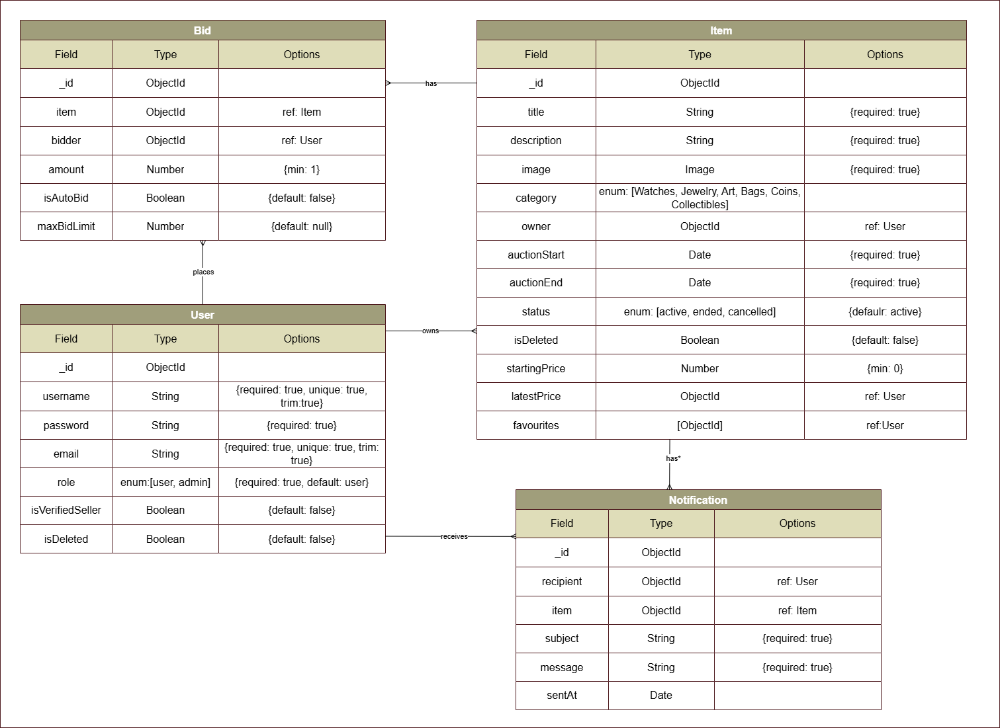

# Eternal
Pieces Beyond Time.

## Backend API

## Overview
This repository contains the Node.js, Express and MongoDB backend for **Eternal Auction House**


## Related Links
- **Backend API:** [Deployed Backend](https://eternalbackend-6qqp.onrender.com/)
- **Frontend Application:**  [Deployed Frontend](https://eternalauctionhouse.netlify.app/items)
- **Frontend Repository:** [Frontend Github Repository](https://github.com/zahera-sh/EternalFrontend)


## Technologies Used
- Node.js
- Express
- MongoDB
- Mongoose
- JSON Web Tokens
- bcrypt
- dotenv
- Morgan
- Jest
- Supertest


## Features
- User registration
- User login and logout
- Authentication middleware
- CRUD API endpoints
- Request validation
- MongoDB relationships
- Rate Limiting
- Clear Error Handling with proper status codes
- Search and filtering
- Automated API tests
- Role-based authorization
- Live auto bidding
- Notification system
- User Verification
- Set item for auction


## Project Structure
```text
EternalBackend/
├── .github/
├── assets/
├── config/
├── controllers/
├── middleware/
├── models/
├── routes/
├── tests/
├── app.js
├── README.md
└── server.js
```


### Folder Responsibilities
| Folder        | Purpose                                         |
| ------------- | ----------------------------------------------- |
| `assets`      | Images          |
| `config`      | Database and application configuration          |
| `controllers` | HTTP request and response handling              |
| `middleware`  | Authentication, validation and error middleware |
| `models`      | Mongoose schemas and models                     |
| `routes`      | Express route definitions                       |
| `tests`       | Automated tests                                 |
| `app.js`      | Express application configuration               |
| `server.js`   | Database connection and server startup          |

## Getting Started

### Prerequisites
Install:
- node.js
- MongoDB Atlas account


## Installation

### 1. Clone the repository
```bash
git clone https://github.com/zahera-sh/EternalBackend
cd EternalBackend
```

### 2. Install dependencies
```bash
npm install
```

### 3. Create the environment file
Create `.env` in the root directory:

```env
PORT=3000
MONGODB_URI=your-connection-string
CLIENT_URL=http://localhost:5173
JWT_SECRET=unique-password
```


### 4. Start the development server
```bash
npm run dev
```

The API should be available at:

```text
http://localhost:3000
```


## Database Models

### 👤 User
| Field              | Type    | Rules                                       |
|--------------------|---------|---------------------------------------------|
| `username`         | String  | Required, unique, trimmed, lowercase        |
| `hashedPassword`   | String  | Required, hidden from JSON responses        |
| `email`            | String  | Required, unique, trimmed                   |
| `role`             | String  | Required, `User` or `Admin`, default `User` |
| `isVerifiedSeller` | Boolean | Default `false`                             |
| `isDeleted`        | Boolean | Default `false`                             |
| `createdAt`        | Date    | Generated automatically                     |
| `updatedAt`        | Date    | Generated automatically                     |

### 🤖 AutoBid
| Field       | Type       | Rules                                      |
|-------------|------------|--------------------------------------------|
| `item`      | ObjectId   | Required, references `Item`                |
| `user`      | ObjectId   | Required, references `User`                |
| `maxLimit`  | Number     | Required                                   |
| `createdAt` | Date       | Defaults to current date/time              |
| `updatedAt` | Date       | Generated automatically by timestamps      |

**Indexes:**
- Unique compound index on `item` and `user`

### 💰 Bid
| Field          | Type     | Rules                              |
|----------------|----------|------------------------------------|
| `item`         | ObjectId | References `Item`                  |
| `bidder`       | ObjectId | References `User`                  |
| `amount`       | Number   | Minimum value of `1`               |
| `isAutoBid`    | Boolean  | Defaults to `false`                |
| `maxBidLimit`  | Number   | Defaults to `null`                 |
| `createdAt`    | Date     | Generated automatically            |
| `updatedAt`    | Date     | Generated automatically            |

### 🏺 Item
| Field            | Type       | Rules                                                                         |
|------------------|------------|-------------------------------------------------------------------------------|
| `title`          | String     | Required                                                                      |
| `description`    | String     | Required                                                                      |
| `image.url`      | String     | Required                                                                      |
| `image.publicId` | String     | Required                                                                      |
| `category`       | String     | `Watches`, `Jewelry`, `Art`, `Bags`, `Coins`, `Collectibles`                  |
| `owner`          | ObjectId   | References `User`                                                             |
| `auctionStart`   | Date       | Required                                                                      |
| `auctionEnd`     | Date       | Required                                                                      |
| `status`         | String     | `Active`, `Ended`, `Cancelled`, `Sold`, `Starting Soon`; defaults to `Active` |
| `isDeleted`      | Boolean    | Defaults to `false`                                                           |
| `startingPrice`  | Number     | Minimum value of `0`                                                          |
| `latestBid`      | ObjectId   | References `Bid`                                                              |
| `favourites`     | [ObjectId] | References `User`                                                             |
| `createdAt`      | Date       | Generated automatically                                                       |
| `updatedAt`      | Date       | Generated automatically                                                       |

### 🔔 Notification
| Field         | Type     | Rules                          |
|---------------|----------|--------------------------------|
| `recipient`   | ObjectId | References `User`              |
| `item`        | ObjectId | References `Item`              |
| `subject`     | String   | Required                       |
| `message`     | String   | Required                       |
| `sentAt`      | Date     | Defaults to current date/time  |
| `createdAt`   | Date     | Generated automatically        |
| `updatedAt`   | Date     | Generated automatically        |


## Entity Relationships



## API Base URL

Local development:

```text
http://localhost:3000
```

Production:

```text
https://your-deployed-api.com
```

## Endpoints

### Authentication
| Method | Endpoint   | Access        | Description          |
|--------|------------|---------------|----------------------|
| `POST` | `/sign-up` | Public        | Register a new user  |
| `POST` | `/sign-in` | Public        | Sign in a user       |
| `GET`  | `/me`      | Authenticated | Get current user     |

### Admin
| Method | Endpoint             | Access | Description                  |
|--------|----------------------|--------|------------------------------|
| `GET`  | `/all-users`         | Admin  | Get all users                |
| `GET`  | `/all-bids`          | Admin  | Get all bids                 |
| `PUT`  | `/verify/:userId`    | Admin  | Verify a seller              |
| `PUT`  | `/delete/:userId`    | Admin  | Delete a user                |

### Bid
| Method | Endpoint             | Access        | Description          |
|--------|----------------------|---------------|----------------------|
| `POST` | `/:itemId/bids`      | Authenticated | Place a bid          |
| `GET`  | `/:itemId/bids`      | Public        | Get bids for an item |

### Item
| Method   | Endpoint        | Access        | Description                    |
|----------|-----------------|---------------|--------------------------------|
| `POST`   | `/`             | Authenticated | Create an item                 |
| `GET`    | `/`             | Public        | Get all items                  |
| `GET`    | `/filter`       | Public        | Filter items                   |
| `GET`    | `/my-items`     | Authenticated | Get user's own items           |
| `GET`    | `/:id`          | Public        | Get one item                   |
| `DELETE` | `/:id`          | Authenticated | Delete an item                 |
| `POST`   | `/:id/like`     | Authenticated | Add item to favourites         |
| `POST`   | `/:id/dislike`  | Authenticated | Remove item from favourites    |

### Notification
| Method | Endpoint | Access | Description             |
|--------|----------|--------|-------------------------|
| `POST` | `/`      | Public | Create a notification   |

### User
| Method | Endpoint      | Access        | Description              |
|--------|---------------|---------------|--------------------------|
| `GET`  | `/dashboard`  | Authenticated | Get user dashboard       |


## Status Codes
| Status | Meaning in this API                |
| -----: | ---------------------------------- |
|  `200` | Successful request                 |
|  `201` | Resource created                   |
|  `204` | Successful deletion with no body   |
|  `400` | Invalid request                    |
|  `401` | Authentication required or invalid |
|  `403` | Authenticated but not permitted    |
|  `404` | Resource not found                 |
|  `409` | Resource conflict                  |
|  `429` | Too many requests                  |
|  `500` | Unexpected server error            |


## Testing
Run tests:

```bash
npm test
```

Tests should use a dedicated test database or an in-memory database.

## Future Enhancements
1. Add a money deposite function.
2. Auto receipt generating.
3. Third-party authenticity verification.
4. Third-party verified and secure payment processor.


## Team Members
**Eternal.** is designed and developed by:

| Name           | GitHub                                          | Responsibilities   |
| -------------- | ----------------------------------------------- | ------------------ |
| Zahera Sh.     | [🪞✨](https://github.com/zahera-sh)           | Backend API        |
| Zahraa Tawfeeq | [🌊🦢](https://github.com/ZahraaTawfeeq)       | Backend API        |
| Fatema Buarki  | [🖼️🐚](https://github.com/fatemabuarki77-spec) | Backend API        |


## Credits
Special thanks to our instructor [Mr. Omar](https://github.com/omarakamal) and teaching assistants for their guidance, support, and feedback throughout the project.


## License
This project was created as the third project of the General Assembly Software Engineering Bootcamp and is open source. You are welcome to view, study, use, modify, and distribute this project for personal or educational purposes only, provided that appropriate credit is given to the original authors.
